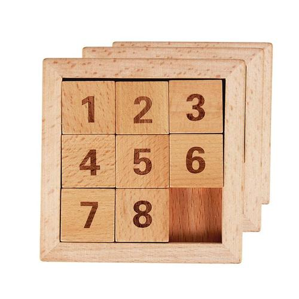
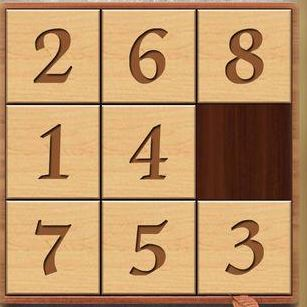

数字华容道
======================================

## 游戏介绍

数字华容道是一个移动拼接游戏， 一般游戏有9个方格(3x3), 数字1-8包含一个空位置。如图1：

  
  *图1*

**当然也有4x4的， 5x5的等等**

## 解决方法：

### 3x3:
&nbsp;&nbsp;&nbsp;&nbsp;其他这个解法很简单，请你观察图1，当前是正确的摆法。忽略中间的5，从1顺时针数字的顺序为： 1->2->3->6->8->7->4 [^忽略空] 。在移动的时候你就可以以这个顺序为目标进行移动， 我们总让每个块进行逆时针移动，移动过程中，让2跟在1的后面， 3跟在二的后面以此类推。如果顺序一旦确定，不要在他们中间插入其他数字。一旦它们的顺序排序好后， 自然就解决了。

### NxN(n>3):
&nbsp;&nbsp;&nbsp;&nbsp;对于NxN的，只需要先把外围一圈进行排列好， 变成n-1 x n-1的游戏， 直到3x3。 然后再解决3x3的问题即可。

## 扩充思考

### 问题1、 假如你把所有的块都拿出来， 然后随便放进去，一定可以移动成图1的顺序吗？ 能用数学方法证明吗？

**试图解答：** 如果你手边有这个游戏的话，你可以先试试。 你会发现并不是每次都能成功。那为什么呢？ 我们首先需要了解一个概念就是**逆序列个数**。什么是逆序列呢？假如我们有个数字队列如下：
> 3 4 6 1

它的逆序列个数是多少呢？ 让我们来数一数： 从3开始， 3只大于1 所以对于3逆序数是1， 4的逆序数也是1，6的也是1，1的逆序数是0， 所以 1 + 1 + 1 + 0 = 3， 所以上面队列的逆序数为3。

同样我们看下下图, 算一下它的逆序数：

我们先把他们排成一队：
> 2 6 8 1 4 [空] 7 5 3

它的逆序数是： 1 + 3 + 5 + 0 + 1 + 2 + 1 + 0 = 13 . 空格忽略

那让我们再观察一下，如果移动某个数字会怎么样？ 
先看下移动4， 如果移动4， 队列的逆序数不变，如果移动3， 逆序数减少2， 如果移动8逆序数减少2.